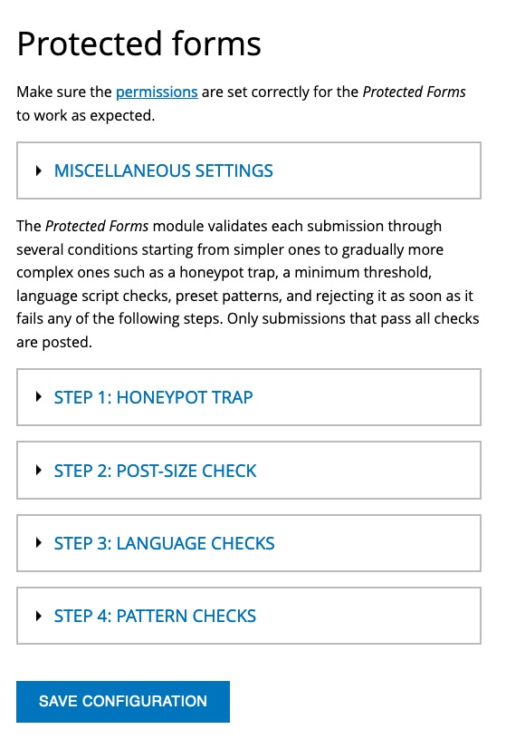

Description
-----------
**Protected Forms** is a light-weight, non-intrusive spam protection module that enables rejection of all non-admin form
submissions which triggered honeypot trap, failed the minimum threshold or contained undesired language scripts or
preset patterns.



How it works
------------
If a user attempts to add a content that triggers a honeypot field, or of length that is less than set minimum
threshold, or that contains a trigger pattern in the name, subject, body or any other _textarea_  or _textfield_ type
field, then the submission is rejected giving the preset error message.

Roles can be configured to bypass the _Protected Forms validation_.

The number of rejected submissions is shown on the **Reports > Status report** (`admin/reports/status`) page.

The rejected messages are logged and can be viewed on the **Reports > Recent log messages** (`admin/reports/dblog`)
page.

If [IP address blocking](https://backdropcms.org/project/ip_blocking) module is enabled, then threshold can be set for
spammers to automatically get banned.

Installation
------------
Download and place the recommended version of the module in your website's modules directory, go to the
**Functionality** page (`/admin/modules`) and enable the **Protected Forms** module.

Alternatively, if you have [Brush](https://github.com/backdrop-contrib/brush) installed, then just run on CLI:
```
brush -y en protected_forms
```

Configuration
-------------
Go to the **Protected Forms** configuration page (`/admin/config/content/protected_forms`), set the allowed language
scripts, reject message text, and the trigger patterns for rejection.

If you want to protect only anonymous submissions, then make sure to go to Permissions page
(`/admin/people/permissions#module-protected_forms`) and put a check mark for authenticated user role next to the
_Bypass Protected Forms validation_ option.

Troubleshooting
---------------
Report all the issues on
https://github.com/backdrop-contrib/protected_forms/issues.

Credits
-------
The [Protected Forms](https://www.drupal.org/project/protected_forms) module had initially been created for Drupal, then ported to Backdrop by [AltaGrade](https://www.altagrade.com) team.
